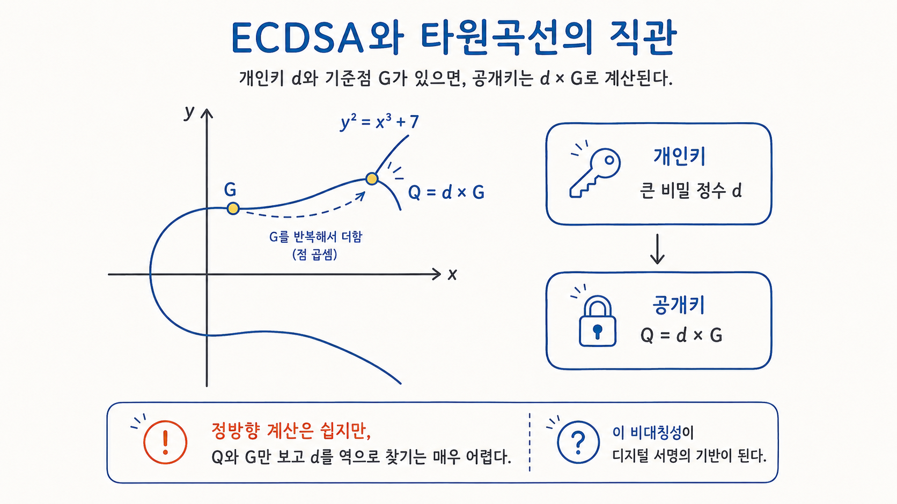
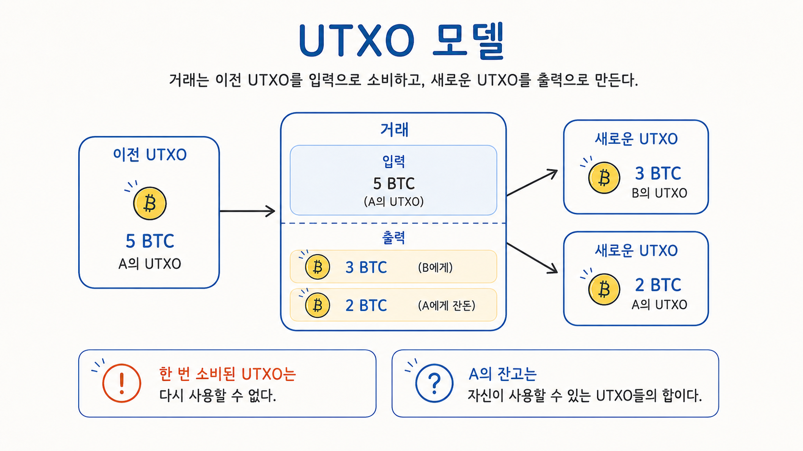
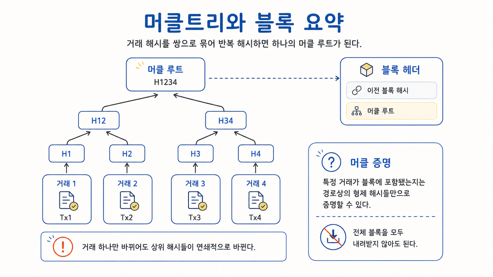
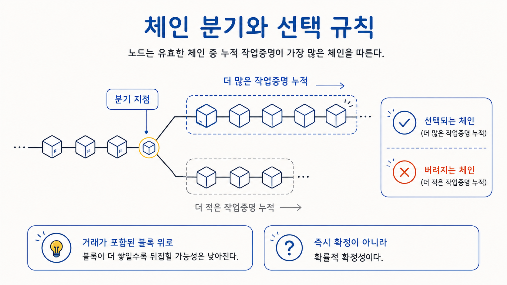

## 개요

[1편](/post/why-blockchain-emerged/)에서는 블록체인이 왜 등장했는지를 다뤘다. 인터넷에서 중앙기관 없이 디지털 자산을 만들 수 있는가라는 질문에서 출발해, 그 질문에 대한 첫 번째 실용적 답으로 Bitcoin이 등장하기까지의 흐름이었다. 다만 그 글에서는 Bitcoin이 "선행 시도들의 조각을 결합한 것"이라는 정도로만 정리하고, 그 결합이 구체적으로 어떻게 작동하는지는 다음 글로 미뤄두었다.

이번 글은 그 빈자리를 채운다. Bitcoin은 어떻게 중앙 서버 없이도 누가 어떤 돈을 가지고 있고 어떤 거래가 유효한지에 대해 네트워크 전체가 합의할 수 있게 만들었는가. 이 질문에 답하려면 다섯 가지 메커니즘을 차례로 봐야 한다. 디지털 서명으로 소유권을 증명하는 방식, UTXO로 상태를 표현하는 방식, 머클트리로 거래를 묶고 요약하는 방식, 작업증명으로 블록 생성 권한을 정하는 방식, 그리고 누적 작업량으로 하나의 기록을 고르는 방식이다.

이번 글은 1편보다 기술적으로 한 단계 더 들어간다. 다만 Script opcode나 채굴 알고리즘 세부 같은 깊은 디테일까지는 들어가지 않았고, 더 알고 싶은 부분은 토글로 처리해두었다. 이 글의 목표는 Bitcoin을 완전히 해부하는 것이 아니라, 1편에서 던진 "어떻게 중앙기관 없이 디지털 자산의 소유와 거래에 합의할 수 있는가"라는 질문을 한 단계 더 기술적인 수준에서 짚어보고, Bitcoin이 그 답으로 만들어낸 구조의 큰 그림을 잡아보는 것이다.

## 디지털 서명: 소유권을 증명하는 방식

Bitcoin에서 어떤 돈이 누구의 것인지를 결정하는 방식은 은행 시스템과 근본적으로 다르다. 은행은 누가 어떤 계좌에 얼마를 가지고 있는지를 데이터베이스에 기록하고, 그 기록의 진위는 은행이라는 기관이 보증한다. Bitcoin에는 그런 보증인이 없다. 대신 소유권을 증명하는 다른 방법이 필요했다.

Bitcoin이 선택한 방식은 디지털 서명이다. 각 사용자에게는 한 쌍의 키가 있다. 개인키(private key)는 본인만 알고 있어야 하는 비밀 값이고, 공개키(public key)는 그 개인키에서 파생된 값이지만 누구에게나 보여줘도 안전하다. 거래를 보낼 때, 사용자는 개인키로 거래에 서명한다. 네트워크의 다른 노드들은 그 사용자의 공개키만 가지고도 서명이 유효한지 검증할 수 있다. 개인키 없이는 유효한 서명을 만들 수 없고, 공개키로는 새로운 서명을 만들어내는 게 불가능하니 위조도 막힌다.

그래서 Bitcoin에서 "내가 이 돈의 주인이다"라는 주장은 곧 "나는 이 공개키에 대응하는 유효한 서명을 만들 수 있다"라는 주장이 된다. 소유권은 어떤 데이터베이스의 기록이 아니라, 올바른 서명을 만들 수 있는 능력으로 표현된다.

사용자가 보는 Bitcoin 주소는 공개키 자체라기보다, 공개키나 스크립트 조건을 해시하고 사람이 다루기 쉬운 문자열로 인코딩한 식별자에 가깝다. 해시를 거치면 긴 공개키를 더 짧은 식별자로 다룰 수 있고, 인코딩 과정에서 체크섬을 붙이면 주소를 잘못 입력했을 때 일부 오류를 감지할 수 있다. 세부적으로는 Base58Check 같은 방식이 쓰이지만, 여기서 중요한 것은 주소가 은행 계좌번호라기보다 특정 조건을 만족해야 돈을 쓸 수 있음을 가리키는 식별자라는 점이다.


이 글은 Bitcoin의 대표적인 기존 거래 흐름을 기준으로 설명한다. 이 흐름에서 서명 알고리즘으로 쓰이는 것은 ECDSA(Elliptic Curve Digital Signature Algorithm)이고, 그 기반 곡선은 secp256k1이다.

타원곡선은 보통 y² = x³ + ax + b 형태의 방정식으로 정의된다. secp256k1은 그중에서도 a = 0, b = 7인 곡선을 유한체 위에서 사용하는 특정 매개변수 집합을 가리킨다. 이름의 256은 이 곡선에서 사용하는 기반 수 체계의 크기가 약 256비트라는 뜻으로 보면 된다.

다만 실제 secp256k1은 매끈한 연속 곡선이 아니라, 그 곡선 식을 만족하는 유한체 위의 정수점들로 정의된다. 아래 그림은 연산의 직관을 보여주기 위해 실수 평면 위에 단순화해서 그린 것이다.



타원곡선 위에서는 두 점을 더해 또 다른 점을 만드는 연산이 정의되어 있다. 한 점을 자기 자신과 반복해서 더하는 것을 "점의 곱셈"이라고 부른다. ECDSA에서는 곡선 위에 정해진 기준점(generator point) G가 있고, 개인키는 그저 큰 정수 d 하나다. 공개키는 d × G, 즉 G를 d번 더한 결과다.

공개키 암호는 대부분 한쪽 방향으로는 빠르게 계산되지만 반대로 되돌리기는 어렵다고 알려진 수학 문제 위에 세워진다. 전통적으로 대표적인 두 갈래가 소인수분해 기반(RSA 계열)과 이산로그 기반(DH, DSA, ECDSA 계열)이다. 큰 수를 곱하는 건 쉽지만 결과를 다시 소수로 분해하기는 어렵고, 어떤 값의 거듭제곱은 빠르게 구할 수 있지만 그 지수를 거꾸로 찾아내는 건 어렵다는 식이다. ECDSA는 이 중 이산로그 계열에 속하되, 일반적인 수의 이산로그가 아니라 타원곡선 위에서 정의된 변형을 사용한다. 같은 안전성 수준을 더 짧은 키로 얻을 수 있다는 이점 때문에 Bitcoin을 비롯한 여러 시스템이 이 계열을 택했다.

앞서 정의한 점의 곱셈이 정확히 그 비대칭의 구체적인 모습이다. d와 G를 알면 d × G를 빠르게 계산할 수 있지만, 결과 점과 G만 가지고 d를 역으로 찾아내는 효율적인 방법은 알려져 있지 않다. 이것을 타원곡선 이산로그 문제(ECDLP)라고 부르고, ECDSA의 안전성은 여기에 기댄다.

서명 과정은 메시지의 해시와 개인키, 그리고 서명마다 달라지는 nonce k를 조합해 (r, s)라는 한 쌍의 값을 만드는 과정이다. 검증은 공개키와 메시지 해시로 그 (r, s)가 올바르게 만들어졌는지 확인한다. 이 k는 안전한 난수로 뽑을 수도 있고, 구현에 따라(RFC 6979처럼) 결정론적으로 만들 수도 있다. 다만 어느 방식이든 핵심은 매번 달라야 하고 외부에서 예측 가능해서는 안 된다는 점이다. k가 재사용되거나 예측 가능하면 그 자체로 개인키가 그대로 노출될 수 있고, 이는 ECDSA 기반 시스템에서 가장 기초적이면서도 가장 치명적인 보안 취약점에 속한다.

이 글에서 암호학을 더 깊게 파고들지는 않는다. 결국 가져갈 핵심은 개인키 소유자만 유효한 서명을 만들 수 있고, 네트워크의 다른 노드들이 공개키로 그 서명을 검증할 수 있다는 비대칭 구조 하나다.


## UTXO: Bitcoin의 상태 모델

소유권이 서명으로 증명된다면, 다음 질문은 "그래서 어떤 돈에 대한 소유권인가"이다. 이 질문에 답하는 방식이 Bitcoin과 일반 금융 시스템에서 크게 다르다.

은행 시스템에서 누군가의 잔고를 알고 싶으면 그 사람의 계좌 행을 찾아 잔액 칸의 숫자를 읽으면 된다. A가 B에게 송금하면 A의 잔액 숫자가 줄어들고 B의 잔액 숫자가 늘어난다. 즉, 상태가 "계좌별 잔액"이라는 형태로 직접 저장된다.

Bitcoin은 이렇게 동작하지 않는다. Bitcoin의 상태는 사용자별 잔액이 아니라, 아직 사용되지 않은 거래 출력값들의 집합이다. 이것을 UTXO(Unspent Transaction Output)라고 부른다. 거래는 이전 UTXO를 입력으로 소비하고, 새로운 UTXO를 출력으로 만들어내는 행위다. 한 UTXO가 한 번 소비되면 그 UTXO는 사라지고, 그 자리에 만들어진 새 출력만 남는다.

예를 들어 A가 5 BTC짜리 UTXO를 가지고 있고, B에게 3 BTC를 보내려 한다고 하자. A는 5 BTC UTXO를 통째로 입력에 넣고, 출력으로 두 개를 만든다. B에게 가는 3 BTC와, 자신에게 다시 돌려보내는 2 BTC다. 거래가 끝나면 원래의 5 BTC UTXO는 소비된 상태가 되고, 3 BTC UTXO와 2 BTC UTXO가 새로 생긴다. A의 "잔고"는 어디에도 명시적으로 적혀 있지 않다. 그저 A가 사용할 수 있는 UTXO들이 네트워크 전체에 흩어져 있고, 그것들의 합이 A의 잔고에 해당할 뿐이다.



UTXO 모델은 검증이 비교적 단순하다. 각 거래는 자신이 소비하려는 이전 출력들이 실제로 존재하고 아직 사용되지 않았는지, 그리고 그 출력의 조건을 올바르게 만족하는지만 확인하면 된다. 상태를 계좌별로 계속 갱신하는 방식보다 직관은 덜하지만, 이미 소비된 출력의 재사용을 추적하기 좋고 거래 단위의 검증 경계도 뚜렷하다.

이 구조가 1편에서 다룬 이중지불 문제와 직접 연결된다. 같은 UTXO를 두 번 소비하려는 시도가 곧 이중지불이고, 노드들이 UTXO 집합을 추적하면서 이미 소비된 UTXO의 재사용을 거부함으로써 이중지불을 막는다.

UTXO에 담겨 있는 건 금액만이 아니다. 각 UTXO는 그 출력을 소비하려면 어떤 조건을 만족해야 하는지도 함께 정의한다. Bitcoin에서는 이 조건을 Script로 표현한다. 따라서 거래 검증은 "잔고가 충분한가"를 확인하는 과정이라기보다, "새 거래의 입력이 이전 출력에 걸린 조건을 올바르게 해제하는가"를 확인하는 과정이다. Script가 표현할 수 있는 조건의 범위가 곧 Bitcoin이 다룰 수 있는 거래의 범위가 되는데, 이 표현력은 의도적으로 좁게 설계되어 있다. 이 점이 나중에 중요해진다.


UTXO에 붙는 잠금 조건은 Bitcoin Script라는 작은 스택 기반 언어로 표현된다. 가장 대표적인 표준 형태가 P2PKH(Pay-to-Public-Key-Hash)다.

P2PKH 출력의 잠금 스크립트(locking script)는 보통 다음과 같이 생겼다.

```
OP_DUP OP_HASH160 <publicKeyHash> OP_EQUALVERIFY OP_CHECKSIG
```

풀어 보면 "스택 맨 위 값을 복제하고, 해시하고, 미리 적어둔 공개키 해시와 같은지 확인한 다음, 마지막으로 서명을 검증하라"는 절차다. 이 출력을 쓰려는 새 거래는 입력 쪽에 해제 스크립트(unlocking script)로 서명과 공개키를 제공한다.

```
<signature> <publicKey>
```

노드는 해제 스크립트와 잠금 스크립트를 이어 붙여 스택 위에서 실행한다. 공개키가 스택에 올라가고, 복제되고, 해시되고, 잠금에 적힌 공개키 해시와 비교되며, 그게 통과하면 마지막으로 서명 검증(OP_CHECKSIG)이 일어난다. 모든 단계가 참으로 끝나면 거래는 유효하다.

P2PKH 외에도 P2SH(Pay-to-Script-Hash), P2WPKH 같은 표준 형태들이 있지만, 핵심 원리는 같다. 출력에는 조건이 걸려 있고, 입력은 그 조건을 푸는 증거를 제시하며, 노드는 그 조합을 실행해 통과 여부를 판정한다.

이 구조가 단순하다는 것은 곧 표현할 수 있는 조건이 제한적이라는 뜻이기도 하다. Script는 반복문 같은 것을 지원하지 않고, 표현할 수 있는 로직의 범위가 좁게 설계되어 있다. 이 제한이 보안 측면에서는 장점이지만, 복잡한 애플리케이션을 올리기 어렵게 만드는 요인이 되기도 한다.


## 블록과 머클트리: 거래를 묶고 요약하는 방식

거래 하나하나는 디지털 서명으로 진위가 검증되고 UTXO 모델로 상태가 표현된다. 그렇다면 이 거래들은 어떻게 모여서 하나의 장부를 이룰까.

Bitcoin은 거래들을 블록이라는 단위로 묶는다. 한 블록은 블록 헤더와 거래 목록 두 가지로 이뤄져 있다. 블록 헤더는 80바이트 크기의 작은 메타데이터 구조로, 이 블록을 식별하고 이전 블록과 연결하는 데 필요한 정보들을 담는다. 거래 목록은 말 그대로 그 블록에 포함된 모든 거래들이다.

여기서 흥미로운 부분은 블록 헤더에 거래 목록 자체가 들어가지 않는다는 점이다. 대신 거래들을 요약한 하나의 값, 머클 루트(Merkle Root)만 들어간다. 머클 루트는 블록 안의 모든 거래를 머클트리(Merkle Tree)라는 자료구조로 묶어 만든 결과다.

Bitcoin이 머클트리를 활용하는 방식은 개인적으로 가장 인상적인 부분 중 하나다. 거래 무결성, 효율적 검증, 변경 감지를 한 자료구조로 깔끔하게 해결한다.

머클트리의 구성은 단순하다. 먼저 각 거래의 해시를 계산한다. 그 다음 해시들을 쌍으로 묶고, 각 쌍을 다시 해시한다. 그 결과들을 또 쌍으로 묶고 해시한다. 이 과정을 반복하다 보면 마지막에 하나의 해시 값만 남는다. 그것이 머클 루트다. 거래 목록의 어느 한 거래라도 바뀌면 그 거래의 해시가 바뀌고, 연쇄적으로 상위 해시들이 모두 바뀌면서 결국 머클 루트도 달라진다. 즉, 머클 루트 하나만 비교해도 두 블록의 거래 목록이 동일한지 확인할 수 있다.



머클트리의 진짜 가치는 한 가지 더 있다. 어떤 거래가 특정 블록에 포함되어 있다는 사실을 증명할 때, 전체 거래 목록을 다 보여줄 필요가 없다. 그 거래에서 머클 루트로 올라가는 경로상의 형제 해시들만 제공하면 된다. 이것을 머클 증명(Merkle Proof)이라고 부르고, 블록 하나에 거래가 수천 건 있어도 증명에는 로그 단위의 해시만 필요하다. 이 성질이 Bitcoin 백서에서 언급한 경량 클라이언트, 즉 SPV(Simplified Payment Verification)의 기반이 된다. 다만 머클 증명은 특정 거래가 어떤 블록에 포함됐다는 사실을 보여줄 뿐, 그 블록 안의 모든 거래와 전체 합의 규칙을 완전 노드처럼 검증하는 것은 아니다.

블록 헤더에는 머클 루트 외에 또 하나 중요한 값이 들어간다. 바로 이전 블록 헤더의 해시다. 각 블록이 이전 블록의 해시를 안에 품고 있기 때문에, 블록들은 일렬로 연결된 사슬을 이룬다. 과거 블록의 거래를 하나 바꾸려면 그 블록의 머클 루트가 바뀌고, 헤더 해시가 바뀌고, 그 결과 다음 블록이 가리키던 해시도 더 이상 맞지 않게 된다. 그래서 그 이후의 모든 블록을 다시 만들어야 한다.

다만 여기서 중요한 질문이 하나 남는다. 블록을 다시 만드는 일이 왜 어려워야 하는가. 단순히 해시를 다시 계산하는 것뿐이라면 컴퓨터에게는 어려운 일이 아니다. 이 질문에 답하는 장치가 바로 작업증명이다.

## 작업증명: 누가 다음 블록을 만드는가

블록 구조가 정해졌으니, 다음 질문은 "그래서 누가 그 블록을 만드는가"이다. 중앙 서버가 없는 네트워크에서 이 질문은 의외로 까다롭다.

신원 기반으로 투표를 한다고 해보자. 노드 한 명당 한 표를 주고, 가장 표를 많이 받은 블록을 다음 블록으로 한다. 이 방식은 곧장 무너진다. 누구나 노드를 만들 수 있는 네트워크에서는 한 사람이 노드를 만 개 만들어 영향력을 인위적으로 키울 수 있기 때문이다. 이것을 시빌 공격(Sybil attack)이라고 부른다.

Bitcoin이 이 문제를 푼 방식이 작업증명(Proof-of-Work)이다. 블록을 만들 권리를 신원이 아니라 소모한 계산 비용에 연결한 것이다. 노드가 몇 개이든 상관없다. 실제로 해시 연산이라는 비용을 지불한 측만 블록 생성 경쟁에 의미 있게 참여할 수 있다.

작업증명의 구체적인 형태는 이렇다. 블록 헤더에는 nonce라는 값이 들어 있는데, 채굴자는 이 nonce를 바꿔가며 블록 헤더 전체의 해시를 계산한다. 목표는 그 해시 값이 특정 목표값(target) 이하가 되는 nonce를 찾는 것이다. 해시 함수는 입력이 조금만 달라져도 결과가 완전히 달라지는 성질이 있어서, 어떤 nonce가 목표를 만족할지 미리 알 수 없다. 그저 무작위로 시도해보는 것밖에 방법이 없다. 반면 누군가 답을 제시하면 검증은 단 한 번의 해시 계산으로 끝난다. 풀기는 어렵고, 확인은 쉽다는 비대칭이 작업증명의 핵심이다.

목표값은 네트워크 전체의 해시 연산 능력에 맞춰 주기적으로 조정된다. 채굴자가 많아져 답을 찾는 평균 시간이 짧아지면 목표값이 더 작아지고(=더 어려워지고), 줄어들면 그 반대가 된다. Bitcoin은 평균 블록 생성 시간을 10분으로 유지하도록 이 조정을 자동화해두었다.

정리하면, 작업증명은 "누가 노드를 많이 가지고 있는가"가 아니라 "누가 계산 비용을 지불했는가"를 기준으로 블록 생성 권한을 분배한다. 이 메커니즘이 있기 때문에 Bitcoin은 신원 검증 없는 열린 네트워크에서도 작동할 수 있다.

물론 채굴자가 그 비용을 들이려면 동기가 있어야 한다. 유효한 블록을 만든 채굴자는 새로 발행되는 BTC와 블록에 포함된 거래 수수료를 보상으로 받는다. 다만 발행되는 BTC는 약 4년마다 절반으로 감소하도록 설계되어 있는데, 이것을 반감기(halving)라고 부른다. 초기 50 BTC였던 보상이 25, 12.5, 6.25, 3.125 BTC 식으로 줄어왔고, 장기적으로는 거래 수수료가 채굴 인센티브의 주요 원천이 될 것으로 예상된다.

## 체인 선택: 하나의 기록을 고르는 법

작업증명으로 블록이 만들어진다고 해서 이야기가 끝나는 건 아니다. 분산 네트워크에서는 거의 동시에 두 명의 채굴자가 각각 다른 블록을 만들어 전파하는 일이 충분히 일어날 수 있다. 그 시점에 네트워크는 두 개의 후보 체인을 동시에 가지게 된다. 이것을 분기(fork)라고 한다. 이때 노드들은 어느 체인을 진짜 기록으로 받아들여야 하는가.

Bitcoin의 답은 단순하다. 노드는 자신이 검증한 유효한 체인들 중에서 누적된 작업증명이 가장 많은 체인을 따른다. 흔히 "가장 긴 체인"이라고 표현되지만, 더 정확하게는 가장 많은 계산 비용이 들어간 체인이다. 작업량이 아무리 많아도 규칙을 어긴 블록이 끼어 있으면 노드는 그 체인을 받아들이지 않는다. 분기가 잠시 생기더라도, 이후 어느 한쪽에 더 빨리 블록이 쌓이기 시작하면 다른 쪽 체인은 자연스럽게 버려진다. 버려진 체인에만 들어 있던 거래들은 메인 체인 기준으로는 확정되지 않은 거래가 되고, 충돌하지 않는다면 다시 다른 블록에 포함될 수 있다.



이 규칙은 시간이 지날수록 과거 기록을 뒤집기 어렵게 만든다. 어떤 거래가 블록에 포함된 직후에는 그 블록만 다시 만들어도 뒤집을 수 있지만, 그 위에 블록 N개가 더 쌓인 뒤에는 공격자가 정직한 네트워크보다 더 빠르게 N+1개의 블록을 만들어야 한다. 시간이 가고 블록이 쌓일수록 공격자가 정직한 네트워크를 따라잡을 가능성은 급격히 낮아진다.

그래서 Bitcoin의 확정성은 어떤 한 순간에 결정되지 않는다. "이 거래는 이제 절대 뒤집히지 않는다"는 시점은 존재하지 않고, 다만 시간이 지날수록 뒤집힐 확률이 0에 가까워질 뿐이다. 이런 성질을 확률적 확정성(probabilistic finality)이라고 부른다. Bitcoin 사용자들이 흔히 "6 confirmations" 같은 표현을 쓰는 것도 이 때문이다. 거래가 포함된 블록 자체가 1 confirmation이고, 그 위에 5개의 블록이 더 쌓여 6 confirmations가 되면 실무적으로 되돌리기 어렵다고 본다. 절대적 보장이 아니라 합리적인 안전 기준일 뿐이다.

이 방식은 단순하지만 잘 작동한다. 다만 즉시 확정이 아니라는 점은 Bitcoin과 이후의 다른 합의 모델들을 구분하는 중요한 특징이 된다.

## 마치며

지금까지 살펴본 다섯 가지가 합쳐져 Bitcoin이 만들어진다. 디지털 서명으로 누가 어떤 돈을 쓸 권리가 있는지를 증명하고, UTXO로 그 돈의 상태를 표현하고, 머클트리로 거래들을 하나의 블록으로 요약하고, 작업증명으로 누가 다음 블록을 만들지 결정하고, 누적 작업량 기준으로 어느 체인을 진짜로 받아들일지 합의한다. 이 다섯 가지가 결합되어 중앙 서버 없이도 작동하는 하나의 장부가 만들어진다.

Bitcoin의 설계가 인상적인 이유 중 하나는 그 의도적인 단순함이다. Script 언어는 표현력이 매우 제한되어 있고, 상태 모델도 UTXO처럼 단순한 형태에 머문다. 이것은 한계라기보다 선택이었다. Bitcoin의 목적은 한 가지, 검열저항적인 P2P 전자화폐를 만드는 것이었고, 그 목적에 필요한 만큼만 표현력을 허용하는 게 안전했다.

하지만 이 단순함은 동시에 한계이기도 했다. 누군가는 이 위에서 더 복잡한 것들을 만들고 싶어 했다. 단순 송금 이상의 금융 계약, 자동화된 정산, 사용자 정의 자산, 조건부 실행 같은 것들이다. Bitcoin의 구조 위에서 이런 것들을 구현하기는 어려웠다.

여기서 다음 질문이 나온다. 블록체인을 돈의 장부가 아니라, 임의의 프로그램을 실행할 수 있는 환경으로 확장할 수는 없을까. 다음 편에서는 그 질문에 대한 답으로 등장한 Ethereum을 다룬다.

## Reference

- [Satoshi Nakamoto - Bitcoin: A Peer-to-Peer Electronic Cash System (2008)](https://bitcoin.org/bitcoin.pdf)
- [Andreas M. Antonopoulos - Mastering Bitcoin (3rd Edition)](https://github.com/bitcoinbook/bitcoinbook)
- [Bitcoin Developer Guide - Transactions](https://developer.bitcoin.org/devguide/transactions.html)
- [Bitcoin Developer Guide - Block Chain](https://developer.bitcoin.org/devguide/block_chain.html)
- [Bitcoin Wiki - Script](https://en.bitcoin.it/wiki/Script)
- [Bitcoin Wiki - Proof of work](https://en.bitcoin.it/wiki/Proof_of_work)
- [RFC 6979 - Deterministic Usage of DSA and ECDSA](https://www.rfc-editor.org/rfc/rfc6979)
