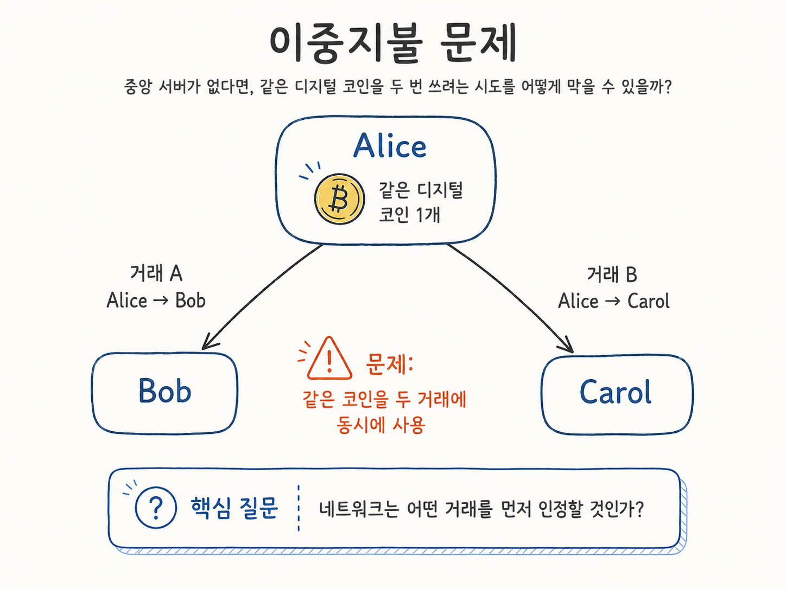
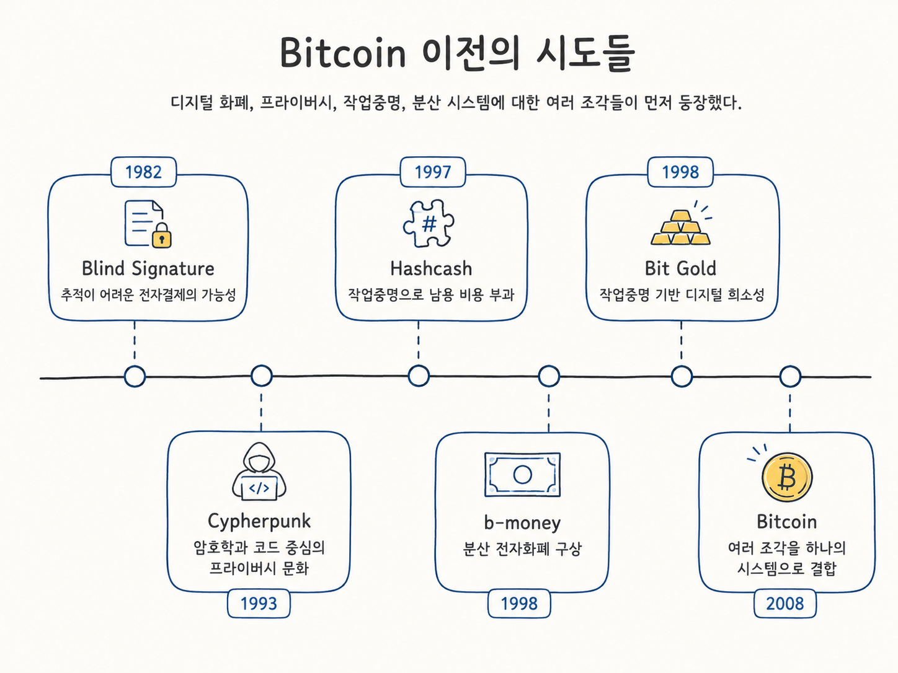

## 개요

블록체인 개발을 공부하면서 주변에서 자주 들었던 말이 있다. 블록체인의 내러티브를 이해해야 한다는 말이다. 내러티브라는 단어가 처음에는 막연하게 들렸지만, 결국 이런 흐름을 가리키는 것이었다. 어떤 한계가 있었고, 그것을 풀기 위해 무엇이 등장했고, 그 과정에서 또 어떤 문제가 새로 생겼는지. 블록체인은 짧은 역사 안에서 이 흐름이 굉장히 빠르게 반복되어 왔고, 그래서 단순히 지금 무엇이 뜨고 있다를 외우는 것보다 왜 그것이 등장했는가를 따라가는 편이 훨씬 오래 남는다.

블록체인 역사에 대해 가볍게는 공부했지만, 정작 깊게 다뤄본 적은 없었다. 글이나 영상으로 한 번 본 내용도 며칠 지나면 다시 흐릿해졌다. 그래서 이번에는 직접 정리해보기로 했다. 시리즈 형식으로 각 시대마다 어떤 문제가 있었고, 그것을 어떻게 풀려고 했고, 결과적으로 무엇이 새로 생겼는지를 한 편씩 다뤄볼 생각이다.

이번 1편에서는 가장 출발점에 있는 질문을 다룬다. 블록체인은 왜 등장했는가. 정리하다 보니 이 질문은 지금의 Web3 담론보다 더 앞선 문제에서 출발한다는 것을 알게 되었다. 그래서 이번 글에서는 인터넷에서 중앙기관 없이 디지털 자산을 만들 수 있는가라는 질문부터 따라가보려고 한다. 시리즈의 첫 글인 만큼 기술적인 디테일보다는 그 출발점에 어떤 문제가 있었고 어떤 흐름 위에서 Bitcoin이 등장했는지를 잡는 데 집중한다. Bitcoin이 풀어낸 기술적 구조는 다음 편부터 본격적으로 다룬다.

## 인터넷에서 자산을 만든다는 문제

인터넷은 정보를 빠르게 복사하고 전파하는 데 최적화된 시스템이다. 사진, 음악, 문서, 게임 데이터는 서버에서 클라이언트로 전송되는 순간 사실상 동일한 사본이 만들어진다. 정보 유통에는 강력하지만, 자산을 표현하기에는 치명적인 특성이다.

돈은 복사되면 안 된다. A가 가진 1만 원을 B에게 보냈다면, A는 더 이상 그 1만 원을 쓸 수 없어야 한다. 그런데 디지털 데이터는 본질적으로 복사 가능하다. A가 디지털 코인을 B에게 보내고, 같은 코인을 다시 C에게 보낸다면 무엇이 그것을 막아주는가? 이 문제가 디지털 화폐의 가장 근본적인 문제, 이중지불(Double-Spending) 문제다.

이중지불 문제는 단순히 디지털 파일이 복사된다는 문제만은 아니다. 더 정확히는 네트워크 전체가 어떤 거래가 먼저 발생했는지에 대해 하나의 순서를 공유할 수 있는가의 문제다. A가 같은 코인을 B에게 보내는 거래와 C에게 보내는 거래를 거의 동시에 전파했다면, 중앙 서버가 없는 네트워크는 둘 중 어느 거래를 유효한 것으로 볼지 결정해야 한다. Bitcoin이 해결하려 한 문제는 이 전역적인 거래 순서 합의였다.

전통적인 전자결제는 이 문제를 단순한 방식으로 해결해왔다. 신뢰받는 장부를 운영하는 누군가가 있으면 된다. 은행, 카드사, PG사, 게임 회사의 데이터베이스 같은 중앙기관이 누가 얼마를 가지고 있는지 기록하고, 같은 돈이 두 번 쓰이지 않도록 관리한다.

이 구조는 오랫동안 잘 작동해왔지만, 두 가지 전제 위에 서 있다. 사용자가 그 중앙기관을 신뢰해야 하고, 그 기관은 검열, 동결, 거래 거부 같은 권한을 가지고 있다는 것이다. Bitcoin 백서는 이 지점을 정확히 짚었다. 디지털 서명만으로는 이중지불을 막을 수 없고, 결국 신뢰받는 제3자가 필요하다면 P2P 전자화폐의 핵심 이점이 사라진다는 것이다.

여기서 진짜 출발점이 되는 질문이 정리된다.

> 중앙기관 없이도, 누가 얼마를 가지고 있고 어떤 거래가 먼저 발생했는지 네트워크 전체가 합의할 수 있는가?

## Bitcoin 이전의 시도들

Bitcoin이 무에서 갑자기 나온 것은 아니다. 1980년대부터 디지털 화폐, 암호학, 분산 시스템에 대한 연구는 이미 누적되어 있었고, Bitcoin은 그 조각들을 결합한 결과물에 가깝다.

David Chaum은 1982년 블라인드 서명을 제안하며 추적이 어려운 전자결제의 가능성을 열었고, 이후 DigiCash/eCash 같은 실험으로 이어졌다. 다만 이 방식은 발행자, 즉 은행에 가까운 중앙 주체를 여전히 필요로 했다. 1993년 Eric Hughes의 *A Cypherpunk's Manifesto*는 프라이버시를 지키려면 정책이 아니라 암호학과 코드가 필요하다는 문화적 토대를 만들었다. 1997년 Adam Back의 Hashcash는 이메일 스팸을 막기 위한 작업증명을 제안했고, 이는 이후 Bitcoin 채굴 메커니즘의 직접적인 전신이 되었다. 1998년 Wei Dai의 b-money와 Nick Szabo의 Bit Gold는 작업증명 기반의 분산 화폐 아이디어를 더 구체화했다.

이 시도들은 각자의 영역에서 의미 있었지만, 실제로 작동하는 네트워크로 통합되지는 못했다. 누군가 이 조각들을 하나의 작동 가능한 시스템으로 묶어내는 일이 남아 있었다.

## Bitcoin — 신뢰를 검증으로 대체하다

2008년 10월, Satoshi Nakamoto라는 익명의 인물이 Cryptography Mailing List에 *Bitcoin: A Peer-to-Peer Electronic Cash System* 백서를 공개했다. 그리고 2009년 1월, Bitcoin v0.1이 릴리즈되었다.

Bitcoin이 한 일은 새로운 발명이라기보다, 이전까지 따로 존재하던 조각들을 하나의 작동 가능한 시스템으로 결합한 것에 가깝다.

- **거래 표현**: 코인을 디지털 서명의 체인으로 정의했다.
- **합의**: P2P 네트워크에 거래를 전파하고, 작업증명으로 블록의 순서를 정했다.
- **장부 무결성**: 블록을 해시로 연결해, 과거 기록을 바꾸려면 이후의 모든 작업을 다시 해야 하도록 만들었다.
- **체인 선택**: 가장 많은 작업이 누적된 체인을 네트워크 전체가 유효한 기록으로 인정한다.

핵심 메시지는 단순하다. 신뢰를 검증으로 대체한다. 사용자가 어떤 기관을 신뢰하는 대신, 누구나 직접 검증 가능한 공개 장부와 암호학적 규칙만 신뢰하면 된다.

Bitcoin의 첫 블록(Genesis Block)에는 "The Times 03/Jan/2009 Chancellor on brink of second bailout for banks"라는 문구가 새겨져 있다. 2008년 글로벌 금융위기 이후 영국 정부가 은행 시스템에 대한 두 번째 구제금융을 검토 중이라는 당시 The Times 1면 헤드라인이다. Bitcoin이 어떤 사회적 분위기 속에서 나왔는지를 단적으로 보여준다. 다만 Bitcoin이 금융위기 때문에 만들어진 것은 아니다. 수십 년에 걸쳐 누적된 디지털 화폐 연구가 이 시점에 결합된 것이고, 금융위기는 그 문제의식이 사회적 설득력을 얻은 배경에 가깝다.

## 디지털 화폐에서 Web3 담론으로

Bitcoin은 탈중앙화된 돈이라는 첫 번째 내러티브를 만들었다. 그러나 Bitcoin의 스크립트 언어로는 복잡한 애플리케이션을 만들기 어려웠다. 단순 송금 이상의 금융 계약, 자동화된 정산, 사용자 정의 자산 같은 것들은 구조적으로 제한되어 있었다.

여기서 다음 질문이 나왔다. 돈뿐 아니라 프로그램도 탈중앙화할 수 있는가. 2015년 Ethereum이 이 질문에 대한 답으로 등장했다. EVM이라는 가상머신 위에서 누구나 스마트컨트랙트를 배포하고 실행할 수 있게 되었고, 이때부터 블록체인은 단순한 송금 장부에서 탈중앙 애플리케이션 플랫폼으로 확장되었다.

이후의 흐름은 익숙하다. ERC-20으로 토큰 발행이 표준화되고, ICO 붐이 일어나고, DeFi가 금융 앱을 온체인에 올리고, NFT가 디지털 소유권을 표현하기 시작하고, DAO가 조직 자체를 코드 위에 올린다. 그리고 이 모든 흐름이 모여 만들어진 서사가 바로 Web3다. 사용자가 플랫폼이 아니라 자기 지갑에서 자산과 정체성을 직접 보유한다는 이야기.

처음에는 Web3가 블록체인의 출발점이라고 생각했지만, 시간 순서를 따라가보면 그렇지 않다. 블록체인이 디지털 자산이라는 근본 문제를 풀면서 만들어낸 도구들이, 시간이 지나면서 Web2 플랫폼 모델에 대한 대안 담론으로 재해석된 것에 가깝다.

## 마치며

블록체인의 시작점을 한 문장으로 정리하면 이렇게 된다. 블록체인은 인터넷에서 중앙기관 없이 희소한 디지털 자산을 만들고, 거래의 순서를 합의하고, 이중지불을 막기 위해 등장했다. Bitcoin은 그 첫 번째 실용적 답이었고, 이후 Ethereum을 거치면서 이 질문은 디지털 계약, 온체인 금융, 디지털 소유권의 서사로 확장되었다.

이번 글에서는 출발점에 있는 가장 큰 질문 하나만 다뤘다. 다음 글부터는 이 흐름을 따라가면서, 시대마다 새로 생긴 문제와 그것을 풀려는 시도들을 하나씩 짚어볼 생각이다. 다음 편에서는 Bitcoin이 이 문제를 실제로 어떻게 풀었는지를 다룬다. 디지털 서명, UTXO, 머클트리, 작업증명, 체인 선택 규칙을 통해 중앙기관 없는 장부가 어떻게 작동하는지 살펴볼 예정이다.

## Reference

- [Satoshi Nakamoto - Bitcoin: A Peer-to-Peer Electronic Cash System (2008)](https://bitcoin.org/bitcoin.pdf)
- [Satoshi Nakamoto - Bitcoin P2P e-cash paper, Cryptography Mailing List (2008)](https://www.metzdowd.com/pipermail/cryptography/2008-October/014810.html)
- [David Chaum - Blind Signatures for Untraceable Payments (1982)](https://link.springer.com/chapter/10.1007/978-1-4757-0602-4_18)
- [Eric Hughes - A Cypherpunk's Manifesto (1993)](https://www.activism.net/cypherpunk/manifesto.html)
- [Adam Back - Hashcash: A Denial of Service Counter-Measure](http://www.hashcash.org/papers/hashcash.pdf)
- [Wei Dai - b-money (1998)](http://www.weidai.com/bmoney.txt)
- [Nick Szabo - Bit Gold](https://nakamotoinstitute.org/library/bit-gold/)
- [Bitcoin Wiki - Genesis block](https://en.bitcoin.it/wiki/Genesis_block)
- [Gavin Wood - ĐApps: What Web 3.0 Looks Like (2014)](https://gavwood.com/dappsweb3.html)
- [NIST - Blockchain Technology Overview](https://www.nist.gov/publications/blockchain-technology-overview)
